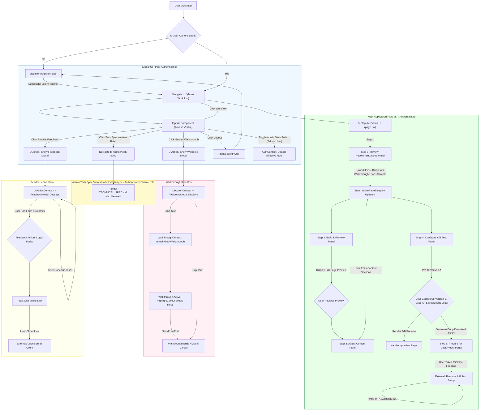

# Technical Specification & Release Guide: SecureTomorrow Landing Page A/B Testing Platform

## 1. Introduction

### 1.1. Purpose of the Application
This Next.js application serves as a comprehensive platform for creating, configuring, and previewing content variations for the SecureTomorrow landing page. It follows a guided 5-step workflow: ingesting page recommendations, building/previewing the page, adjusting content, configuring A/B test variations (primarily for the Hero Section), and preparing for deployment via Firebase. It leverages AI for content suggestions (optionally guided by user-provided campaign themes/keywords) and includes a guided walkthrough for new users. It also integrates Datadog RUM for performance monitoring and includes a client-side feedback mechanism, both accessible via a fixed top navigation bar. Users are required to authenticate to access the main application workflow.

The application is designed with a UX-AI collaborative development approach, aiming for rapid prototyping and iterative feature enhancement to quickly deliver value.

### 1.2. High-Level Functionality
- **User Authentication:** Users must register and log in using Firebase Authentication (Email/Password) to access the main application. (Login/Register pages exist at `/login` and `/register`). The registration form includes a field for "Primary Interest" as a preliminary step towards future role-based features; this selection is currently for data collection and does not enforce roles. Full role implementation based on this is backlogged (`FEATURE_AUTH_ROLES_PAUSED`).
- **Temporary Client-Side Roles & Admin Context Switching:** For current UI differentiation:
    - Users logged in with the email `jason.davey@greenstone.com.au` are treated as 'admin'. This admin user has the ability to switch their UI view to that of a 'creator' using a toggle in the TopBar for testing purposes.
    - All other authenticated users are treated as 'creator'.
- **Fixed Top Bar:** Contains navigation links ("Workflow", "Tech Spec" - latter visible to 'admin' role), user status/auth actions ("Login", "Register", "Logout"), action buttons ("Provide Feedback", "Guided Walkthrough"), and an admin context-switching toggle. Always visible.
- **Guided Workflow:** A 5-step accordion interface (Review, Build, Adjust, A/B Configure, Deploy) on the main page (`/`).
- **Recommendation Ingestion (Step 1):** Allows users to upload a JSON file (`PageBlueprint`) containing recommendations for landing page content.
- **Page Preview (Step 2):** Displays a preview of the entire landing page (Hero, Benefits, Testimonials, Trust Signals, Quote Form) based on the ingested or adjusted blueprint.
- **Content Adjustment (Step 3):** Enables users to fine-tune the content of the landing page blueprint for all major sections via input fields.
- **A/B Test Content Configuration (Step 4):** Allows users to define two text versions for A/B testing (e.g., Hero Section headline, sub-headline, CTA). Version A is pre-filled from Step 3.
- **AI-Assisted Content Generation (Step 4):** Provides AI-powered suggestions for A/B test copy using Genkit and Google's Gemini model. Users can provide an optional "Campaign Focus / Keywords" to further tailor these suggestions.
- **JSON Generation (Step 4):** Automatically generates JSON output compatible with Firebase Remote Config for each A/B test content variation. Allows copying or downloading of JSON.
- **Local Configuration Management (Step 4):** Enables users to save, load, and manage different A/B test content configurations (including campaign focus) directly in their browser's local storage.
- **Side-by-Side A/B Preview (Step 4):** Renders two selected A/B content variations on a dedicated preview page (`/landing-preview`) for visual comparison.
- **Deployment Guidance (Step 5):** Provides instructions for using the generated JSON in Firebase.
- **Guided Walkthrough:** An interactive, step-by-step tour of the application's features, highlighting key UI elements and explaining their purpose. Includes a welcome modal and can auto-load sample data. Triggered from the fixed top bar.
- **Firebase Integration (Indirect):** Prepares content for A/B tests run via Firebase Remote Config and Firebase A/B Testing. Firebase Authentication is used for user management.
- **AB Tasty Integration Point:** Placeholder for AB Tasty's JavaScript snippet.
- **Performance Monitoring:** Integrated with Datadog RUM for client-side performance and error tracking.
- **User Feedback Mechanism:** Provides a modal for users to submit feedback, which currently generates a `mailto:` link and logs to console. Triggered from the fixed top bar.
- **Admin Technical Specification View:** A page (`/admin/tech-spec`) that renders this `TECHNICAL_SPEC.md` document, including dynamic Mermaid diagram rendering. Accessible to users with the 'admin' role (or admin viewing as admin) via the "Tech Spec" link in the TopBar.
- **Login/Register Pages:** `/login` and `/register` pages for Firebase Authentication.

### 1.3. Key Technologies Used
- **Frontend Framework:** Next.js (with App Router)
- **UI Library:** React
- **UI Components:** ShadCN UI
- **Styling:** Tailwind CSS
- **State Management:** React Hooks (useState, useEffect, useCallback), React Context (`UIActionContext` for global modal triggers, `WalkthroughContext` for tour logic, `AuthContext` for user authentication, temporary roles, and admin view switching).
- **Authentication:** Firebase Authentication (Email/Password)
- **A/B Test Content Delivery (Primary Method):** Firebase Remote Config
- **A/B Test Management (Primary Method):** Firebase A/B Testing
- **Client-Side A/B Testing (Alternative/External):** Placeholder for AB Tasty
- **Generative AI (Stack):** Genkit with Google AI (Gemini models)
- **Guided Walkthrough:** Custom implementation using React Context and DOM manipulation.
- **Performance Monitoring:** Datadog RUM Browser SDK.
- **Forms:** React Hook Form with Zod for validation (in Quote Form, Feedback Modal, Register Form).
- **Dynamic Diagram Rendering:** Mermaid.js (for rendering diagrams from text in `TECHNICAL_SPEC.md`).

### 1.4. Development Approach & Methodology
This application has been developed using a highly iterative and collaborative UX-AI model:
- **UX-Driven Requirements:** User experience (UX) defines the core needs, user flows, and desired outcomes.
- **AI-Assisted Implementation:** The AI partner (Firebase Studio App Prototyper) translates these requirements into functional code, including React components, Next.js pages, Genkit flows, and state management logic.
- **Rapid Prototyping & Iteration:** Features are built incrementally, allowing for quick feedback loops and adjustments. This contrasts with traditional waterfall models by delivering working software faster.
- **Conversational Development:** Changes and new features are discussed and refined through natural language interaction, with the AI generating code changes in a structured format (XML).
- **Focus on Value:** Prioritizes features that deliver direct value to the end-users (e.g., marketing team) and the business.
- **Strategic Pausing and Resumption of Features:** Our collaborative process allows for the exploration of features even if they have external dependencies (e.g., awaiting admin access for Firebase Authentication setup). Features can be conceptually designed and their initial code structure laid out, then 'paused' (e.g., by commenting out relevant code and adding clear feature tags like `FEATURE_AUTH_ROLES_PAUSED`). This allows for continued progress on other fronts while keeping the context of the paused feature ready for future resumption, minimizing rework and maintaining development momentum. The "Primary Interest" selection during registration is an example of a UI element built for a feature (full RBAC) that is currently paused at the backend implementation stage.

### 1.5. Development Chronology & Key Milestones (Conceptual)
This provides a high-level overview of the development journey:
- **Phase 0 (Foundation - Initial Setup):**
    - Basic Next.js project structure.
    - ShadCN UI and Tailwind CSS integration.
- **Phase 1 (Core A/B Content Preparation):**
    - Initial A/B test configurator for generating `heroConfig` JSON.
    - Client-side Hero section preview.
    - `PLAYBOOK.md` drafted for Firebase A/B test setup.
    - *Value:* Empowered marketing to generate Firebase-compatible JSON.
- **Phase 2 (Integrated Workflow & Content Structure):**
    - Refactored UI into a 5-Step Accordion Workflow on the main page (`/`).
    *   Defined `PageBlueprint` type for ingesting external recommendations (Step 1).
    *   Implemented multi-section preview (Hero, Benefits, Testimonials, Trust Signals, Form) in Step 2.
    *   Created multi-section content adjustment UI in Step 3.
    *   Migrated A/B Hero configurator to Step 4.
    *   *Value:* Structured app around a clear user journey, enabling intake of external recommendations and holistic page content management.
- **Phase 3 (AI Integration & Usability Enhancements):**
    *   Genkit AI flow (`suggestHeroCopy`) for content suggestions (Headline, Sub-Headline, CTA) in Step 4.
    *   Added "Campaign Focus" input to tailor AI suggestions.
    *   Implemented Local Storage for saving/loading A/B Hero configurations (including campaign focus).
    *   Guided Walkthrough feature (Top Bar button, Welcome Modal, `WalkthroughContext`, `HighlightCallout`).
    *   User Feedback Modal (Top Bar button, `UIActionContext`, mailto link for submission).
    *   Globally Fixed Top Bar for Walkthrough and Feedback, and App Navigation.
    *   Datadog RUM integration for performance monitoring.
    *   Admin page to render `TECHNICAL_SPEC.md` (initially text, then Markdown parsing, then Mermaid diagrams).
    *   *Value:* Boosted user productivity with AI; enhanced UX with onboarding and feedback; implemented observability and admin view with dynamic diagram rendering.
- **Phase 4 (Authentication & Role Foundation - Partially Implemented):**
    - Firebase Authentication (Email/Password) integrated for Login, Register pages.
    - `AuthContext` manages user state and a temporary client-side role ('admin' for `jason.davey@greenstone.com.au`, 'creator' for others), including an admin context-switching capability.
    - Main application workflow (`/`) is protected and requires login.
    - TopBar updated to show auth status and provide Login/Register/Logout actions. "Tech Spec" link in TopBar now visible only to 'admin' role (or admin viewing as admin).
    - Registration form includes a "Primary Interest" field as a UI placeholder for future role assignment; this selection is not currently persisted or used for access control. Full server-side role assignment and enforcement (e.g., using custom claims or Firestore for role storage) is part of the `FEATURE_AUTH_ROLES_PAUSED` context and is considered backlogged.
    - *Value:* Secure access to the application, foundation for user-specific data and roles. The Tech Spec page is now conditionally accessible as a step towards Admin role functionality. The admin user can switch views for testing.

## 2. Application Architecture

### 2.1. Frontend Structure
- **Next.js App Router:**
    - `/`: Main 5-step workflow application (`src/app/page.tsx`). Requires authentication.
    - `/landing-preview`: Side-by-side A/B test preview page. Publicly accessible.
    - `/admin/tech-spec`: Page to render `TECHNICAL_SPEC.md` (including dynamic Mermaid diagrams). Accessible to users with the temporary 'admin' role via the TopBar.
    - `/login`, `/register`: User authentication pages.
- **Key Directories:**
    - `src/app/`: Page components and layouts.
        - `layout.tsx`: Root layout, includes `AuthProvider`, `UIActionProvider`, `TopBar`, `Toaster`, AB Tasty script placeholder, and Datadog RUM initialization.
        - `page.tsx`: Main 5-step workflow application with `WalkthroughProvider`, protected by authentication.
    - `src/components/`:
        - `landing/`: Components specific to the landing page sections (Hero, Benefits, etc.).
        - `ui/`: ShadCN UI components.
        - `walkthrough/`: Components for the guided walkthrough (`WelcomeModal`, `HighlightCallout`).
        - `shared/`: Components like `FeedbackModal.tsx`, `MermaidDiagram.tsx`.
        - `layout/`: Global layout components like `TopBar.tsx`.
    - `src/contexts/`:
        - `UIActionContext.tsx`: Manages global UI states like feedback/welcome modal visibility.
        - `WalkthroughContext.tsx`: Manages state and logic for the guided walkthrough.
        - `AuthContext.tsx`: Manages user authentication state, temporary client-side roles, and admin view-switching.
    - `src/lib/`: Utilities and integrations (Firebase, Datadog).
    - `src/hooks/`: Custom React hooks (`useToast`, `useRemoteConfigValue`, `useMobile`).
    - `src/ai/`: Genkit related files (flows, base configuration).
    - `src/types/`: TypeScript type definitions (`recommendations.ts`).

### 2.2. Data Flow & State Management
- **`AuthContext` (`src/contexts/AuthContext.tsx`):** Globally manages user authentication state (`currentUser`, `loading`), a temporary client-side `userRole` ('admin' or 'creator'), an `isActualAdmin` flag, and view-switching (`viewingAsRole`, `setViewOverride`).
- **`UIActionContext` (`src/contexts/UIActionContext.tsx`):** Globally manages visibility of `FeedbackModal` and `WelcomeModal` (for walkthrough), triggered by `TopBar`.
- **`WalkthroughContext` (`src/contexts/WalkthroughContext.tsx`):** Manages the state of the interactive guided tour, including current step and active status. Triggered by `WelcomeModal` via `UIActionContext`.
- **`activePageBlueprint` (State in `src/app/page.tsx`):** Holds `PageBlueprint` data, loaded in Step 1, previewed in Step 2, modified in Step 3.
- **A/B Test Configurations (Step 4 in `src/app/page.tsx`):** Local storage management for A/B Hero variants (headline, sub-headline, CTA, campaignFocus). (Future: Could migrate to Firestore for authenticated users).
- **Firebase Integration:**
    - Firebase Authentication for user login/registration. The selected "Primary Interest" during registration is not currently saved to the user profile or used for role assignment (backlogged).
    - Prepares JSON for `heroConfig` (Remote Config). Actual A/B test setup in Firebase Console.
- **Genkit/AI:** `suggestHeroCopyFlow` called from client-side in Step 4.
- **Datadog RUM:** Initialized in `layout.tsx`.
- **Mermaid.js:** Used in `/admin/tech-spec` page to render diagrams client-side from Markdown.

### 2.3. Workflow Overview (5-Step Accordion on `/`)
- **Prerequisite:** User must be logged in.
- **1. Step 1: Review Recommendations:** Upload `PageBlueprint` JSON.
- **2. Step 2: Build & Preview Page:** Renders full landing page preview from `activePageBlueprint`.
- **3. Step 3: Adjust Content:** Edit content for all sections of `activePageBlueprint`.
- **4. Step 4: Configure A/B Test:** Configure Hero A/B variants, use AI, save/load local configs, preview on `/landing-preview`.
- **5. Step 5: Prepare for Deployment:** Guidance for Firebase.
- **Global Fixed Top Bar:** Provides navigation ("Workflow", "Tech Spec" - for 'admin' role), user auth actions (Login/Register/Logout), admin view-switching toggle, and access to Guided Walkthrough (via `WelcomeModal`), Feedback (via `FeedbackModal`).

### 2.4. System Architecture & Connections

This diagram illustrates the key components and their interactions. It is dynamically rendered using Mermaid.js from the code block below when viewing this spec in the application at `/admin/tech-spec`.

```mermaid
graph TD
    subgraph UserBrowser [User's Browser - Next.js App]
        App[Landing Page Workflow App]
        App_PageTsx["src/app/page.tsx (Main Workflow)"]
        App_AdminSpecPage["src/app/admin/tech-spec/page.tsx (Tech Spec View with Mermaid)"]
        App_LayoutTsx["src/app/layout.tsx (Global Layout)"]
        App_AuthContext["AuthContext (Firebase Auth State, Temp Roles & Admin View Switch)"]
        App_UIActionContext["UIActionContext"]
        App_WalkthroughContext["WalkthroughContext"]
        App_TopBar["TopBar Component (Nav, Feedback, Walkthrough, Auth, Admin View Switch)"]
        App_FeedbackModal["FeedbackModal Component"]
        App_WelcomeModal["WelcomeModal Component"]
        App_GenkitFlow["Genkit: suggestHeroCopyFlow (Client Call)"]
        App_LocalStorage["Browser Local Storage (A/B Hero Configs)"]
        App_DatadogLib["Datadog RUM SDK"]
        App_TechSpecFile["TECHNICAL_SPEC.md (File System - Read by Server Component)"]
        App_MermaidLib["Mermaid.js Library (Client-side rendering)"]
        App_LoginRegister["Login/Register Pages"]


        App_LayoutTsx --> App_AuthContext
        App_LayoutTsx --> App_UIActionContext
        App_LayoutTsx --> App_TopBar
        App_LayoutTsx --> App_DatadogLib

        App_PageTsx --> App_WalkthroughContext
        App_PageTsx --> App_FeedbackModal
        App_PageTsx --> App_WelcomeModal
        App_PageTsx <--> App_LocalStorage
        App_PageTsx --> App_GenkitFlow
        
        App_AdminSpecPage -- Reads --> App_TechSpecFile
        App_AdminSpecPage -- Uses --> App_MermaidLib


        App_TopBar --> App_AuthContext
        App_TopBar --> App_UIActionContext
        App_TopBar -- Navigates to --> App_PageTsx
        App_TopBar -- Navigates to (admin role) --> App_AdminSpecPage
        App_TopBar -- Navigates to --> App_LoginRegister

        App_WelcomeModal --> App_UIActionContext
        App_WelcomeModal --> App_WalkthroughContext
        App_FeedbackModal --> App_UIActionContext
    end

    subgraph FirebaseServices [Firebase Project]
        FB_Auth["Firebase Authentication"]
        FB_RemoteConfig["Firebase Remote Config (heroConfig)"]
        FB_ABTesting["Firebase A/B Testing (via Console)"]
        FB_Hosting["Firebase Hosting (Next.js App Deployed)"]
        FB_AI_Models["Google AI Models (via GoogleAI Plugin for Genkit)"]
        %% FB_Firestore["Firebase Firestore (Future for user data/roles)"]
    end

    subgraph ExternalSystems [External Systems & Tools]
        RecommendationsEngine["External: Recommendations Engine (Generates PageBlueprint JSON)"]
        DatadogPlatform["Datadog Platform"]
        ServiceNow["ServiceNow (Conceptual - via Backend)"]
        UserEmailClient["User's Email Client"]
        %% GoogleKeywordPlatform["Google Keyword Platform (Future - via Backend)"]
    end

    UserBrowser -- Firebase SDK Calls --> FB_Auth
    UserBrowser -- Firebase SDK Calls --> FB_RemoteConfig
    App_GenkitFlow -- API Call via Genkit --> FB_AI_Models
    App_DatadogLib -- Sends RUM Data --> DatadogPlatform

    RecommendationsEngine -- "*.json File Upload" --> App_PageTsx

    App_FeedbackModal -- "mailto: (current)" --> UserEmailClient
    %% App_FeedbackModal -- "HTTPS to Backend (future)" --> ServiceNow_Backend[Backend API for ServiceNow]
    %% ServiceNow_Backend -- "ServiceNow API" --> ServiceNow
    
    style UserBrowser fill:#e6f7ff,stroke:#0052cc
    style FirebaseServices fill:#fff0e6,stroke:#ff6600
    style ExternalSystems fill:#e6ffe6,stroke:#006400
```



## 3. Core Features & Functionality

### 3.1. User Authentication
- **Mechanism:** Firebase Authentication using Email/Password.
- **Pages:** `/login` for sign-in, `/register` for new user creation.
- **Registration Form:** Includes a "Primary Interest" field for users to indicate their intended use (e.g., "Creating and Managing Landing Page Content"). This selection is currently for future planning and not used for role assignment or access control (backlogged as part of `FEATURE_AUTH_ROLES_PAUSED`).
- **Protection:** The main application workflow at `/` is protected. Users are redirected to `/login` if not authenticated.
- **State Management:** `AuthContext` provides `currentUser`, `loading` state, a temporary client-side `userRole` ('admin' or 'creator'), `isActualAdmin` flag, and admin view-switching (`viewingAsRole`, `setViewOverride`).
- **UI:** `TopBar` displays user email and "Logout" button if logged in, or "Login"/"Register" links if not. It also shows an Admin view-switching toggle if the user is the designated admin.

### 3.2. Global Fixed Top Bar (`src/components/layout/TopBar.tsx`)
- **Purpose:** Provides persistent navigation, user authentication status/actions, admin view-switching, and access to global application utilities.
- **Features:**
    - Fixed position at the top of the viewport.
    - Navigation links:
        - "Workflow": Navigates to the main 5-step application (`/`).
        - "Tech Spec": Navigates to the rendered technical specification page (`/admin/tech-spec`). Visible only to users with the 'admin' role (or admin viewing as admin).
    - User Authentication:
        - Displays user email and "Logout" button if logged in.
        - Displays "Login" and "Register" links if not logged in.
    - Admin View Switch:
        - If logged-in user is the designated admin (`jason.davey@greenstone.com.au`), a toggle appears allowing them to switch their UI view between 'admin' and 'creator' modes.
    - Action Buttons:
        - "Provide Feedback" button: Triggers `FeedbackModal` via `UIActionContext`.
        - "Guided Walkthrough" button: Triggers `WelcomeModal` via `UIActionContext`.
    - Styled with background and bottom border for visual separation.

### 3.3. User Feedback Mechanism (`src/components/shared/FeedbackModal.tsx`)
- **Purpose:** Allow users to report issues, suggest features, or provide general feedback.
- **Features:**
    - Triggered from the global `TopBar`.
    - Modal dialog managed by `UIActionContext`.
    - Form for feedback type, description, email (uses `react-hook-form`).
    - On submission: logs to console, generates `mailto:` link, shows toast. (Future: Could send to backend for ServiceNow integration).

### 3.4. Guided Walkthrough (`src/contexts/WalkthroughContext.tsx`, `src/components/walkthrough/*`)
- **Purpose:** Interactive onboarding for new users.
- **Features:**
    - `WelcomeModal.tsx`: Initial introduction, triggered by `TopBar` via `UIActionContext`.
    - `HighlightCallout.tsx`: Step-by-step guidance with overlay and callouts.
    - `WalkthroughContext.tsx`: Manages tour state, step definitions, and progression.
    - Auto-loads sample `PageBlueprint` for demonstration.

### 3.5. 5-Step Accordion Workflow (`src/app/page.tsx`)
- **Purpose:** Guides the user through landing page creation and A/B test setup.
- **Step 1: Review Recommendations:**
    - File input for uploading `PageBlueprint` JSON.
    - Displays uploaded file name and a preview of the JSON content.
- **Step 2: Build & Preview Page:**
    - Renders a full preview of the landing page (Hero, Benefits, Testimonials, Trust Signals, Quote Form) based on `activePageBlueprint`.
- **Step 3: Adjust Content:**
    - Provides UI (forms with inputs/textareas) to edit content for each section of the `activePageBlueprint`.
    - Sections include: Page Info, Hero, Benefits (list), Testimonials (list), Trust Signals (list), Form Config.
- **Step 4: Configure A/B Test (Hero Section):**
    - Version A is pre-filled from `activePageBlueprint.heroConfig`.
    - UI to configure Version B content (headline, sub-headline, CTA).
    - "Campaign Focus / Keywords" textarea for both versions to guide AI.
    - AI content suggestions (✨) for headline, sub-headline, CTA.
    - Local storage management to save/load/delete named A/B Hero configurations (including campaign focus).
    - Generates JSON for Version A and B; allows copy/download.
    - "Render A/B Versions for Preview" button (links to `/landing-preview` with configs).
- **Step 5: Prepare for Deployment:**
    - Instructions for using generated JSON in Firebase.
    - Link to Firebase Console.
    - Reference to `PLAYBOOK.md`.

### 3.6. Landing Page Preview (`/landing-preview`)
- Displays two Hero sections side-by-side based on `configA` and `configB` JSON passed in URL query parameters.
- Shows other sections (Benefits, Testimonials etc.) with default or static content.

### 3.7. AI Content Suggestions (`src/ai/flows/suggest-hero-copy-flow.ts`)
- Genkit flow that suggests hero copy (headline, sub-headline, CTA).
- Input: copy type, current text, product info, count, and optional `campaignFocus`.
- Output: Array of string suggestions.
- Integrated into Step 4 of the main workflow.

### 3.8. Performance Monitoring (`src/lib/datadog.ts`, `src/app/layout.tsx`)
- Datadog RUM Browser SDK integrated.
- Initializes in `layout.tsx` using environment variables.
- Collects client-side performance metrics and errors.

### 3.9. Admin View for Technical Specification (`src/app/admin/tech-spec/page.tsx`)
- **Purpose:** Allows viewing of the `TECHNICAL_SPEC.md` file rendered within the application.
- **Access:** Via a "Tech Spec" link in the global `TopBar`. Visible only to users with the 'admin' role (or admin viewing as admin).
- **Functionality:** Reads `TECHNICAL_SPEC.md` from the file system (server-side) and displays its content, parsing basic Markdown (H1-H3, images) and dynamically rendering Mermaid diagrams from ` ```mermaid ` code blocks client-side. Includes a Table of Contents.

## 4. Setup & Configuration

### 4.1. Environment Variables (`.env.local`)
- **Required for Firebase SDK (Auth, Remote Config etc.):**
    - `NEXT_PUBLIC_FIREBASE_API_KEY`
    - `NEXT_PUBLIC_FIREBASE_AUTH_DOMAIN`
    - `NEXT_PUBLIC_FIREBASE_PROJECT_ID`
    - `NEXT_PUBLIC_FIREBASE_STORAGE_BUCKET`
    - `NEXT_PUBLIC_FIREBASE_MESSAGING_SENDER_ID`
    - `NEXT_PUBLIC_FIREBASE_APP_ID`
    - `NEXT_PUBLIC_FIREBASE_MEASUREMENT_ID`
- Genkit flows using Google AI require API key setup.
- **Datadog RUM Integration:**
    - `NEXT_PUBLIC_DATADOG_CLIENT_TOKEN`
    - `NEXT_PUBLIC_DATADOG_APPLICATION_ID`
    - `NEXT_PUBLIC_DATADOG_SITE` (e.g., 'datadoghq.com')
    - `NEXT_PUBLIC_DATADOG_SERVICE_NAME` (e.g., 'securetomorrow-landing-builder')
    - `NEXT_PUBLIC_APP_ENV` (e.g., 'development', 'production')
    - `NEXT_PUBLIC_APP_VERSION` (e.g., '1.0.0')

### 4.2. Firebase Project Setup
- See `PLAYBOOK.md`.
- **Firebase Authentication:** "Email/Password" sign-in method must be enabled in the Firebase console.
- Remote Config for `heroConfig`.

### 4.3. AB Tasty Integration
- Placeholder in `src/app/layout.tsx`.

### 4.4. Datadog Setup
- Datadog account and RUM application setup required.

### 4.5. Considerations for Scalability, Risk, Compliance, & Data
- **Scalability:**
    - Client-side focus with reliance on scalable cloud services (Firebase, Datadog).
    - User-specific data (A/B Hero configs) stored in browser Local Storage. (Future: Migrating this to Firestore per user would enhance scalability when authentication is active).
    - Future token-based design system could aid multi-brand scalability.
- **Risk Mitigation:**
    - No direct client-side modification of Firebase A/B tests or sensitive Remote Config parameters. Users are guided to the secure Firebase Console.
    - Generated JSON is for content; platform management for Firebase is separate.
    - Firebase Authentication handles secure user authentication.
- **Compliance & Data Sovereignty:**
    - The app primarily handles content configuration.
    - Data entered by users for A/B Hero configs is stored in their browser's Local Storage.
    - Feedback data (if email provided) is currently handled via `mailto:` or console.
    - User authentication data (email, hashed password) is managed by Firebase Authentication. Role information (like "Primary Interest") is collected during registration but not yet persisted or used for access control (backlogged as part of `FEATURE_AUTH_ROLES_PAUSED`).
    - Firebase/Datadog data residency depends on their respective configurations.
    - Any production deployment must adhere to Greenstone's data governance policies.
- **Legal:** The "free legal will" mentioned in example content is illustrative; actual legal product details are external to this tool's function.
- **APIs:**
    - Internal: Genkit flow for AI suggestions.
    - External (Conceptual/Future): ServiceNow (via backend), Google Keyword platforms (via backend).
- **Tracking:** Datadog RUM for performance and errors.

## 5. Development & Build
- App: `npm run dev` (or `yarn dev`) - `http://localhost:9002`.
- Genkit: `npm run genkit:dev`.
- Build: `npm run build` (or `yarn build`).

## 6. Key Files & Directories
- **`PLAYBOOK.md`:** User-focused guide for A/B testing and app features, including login/registration.
- **`TECHNICAL_SPEC.md`:** (This document).
- **`src/app/layout.tsx`:** Root layout, global providers (`AuthProvider`, `UIActionProvider`), `TopBar`.
- **`src/app/page.tsx`:** Main 5-step workflow application, `WalkthroughProvider`, auth-protected.
- **`src/app/admin/tech-spec/page.tsx`:** Renders `TECHNICAL_SPEC.md` with dynamic Mermaid.
- **`src/app/login/page.tsx` & `src/app/register/page.tsx`:** User authentication pages.
- **`src/contexts/AuthContext.tsx`:** Manages user authentication state, temporary client-side roles, and admin view-switching.
- **`src/contexts/UIActionContext.tsx`:** Manages global modal states.
- **`src/contexts/WalkthroughContext.tsx`:** Manages guided tour state.
- **`src/components/layout/TopBar.tsx`:** Fixed top navigation bar with auth state, conditional admin links, and admin view-switching.
- **`src/components/shared/FeedbackModal.tsx`:** Feedback collection UI.
- **`src/components/shared/MermaidDiagram.tsx`:** Renders Mermaid diagrams.
- **`src/components/walkthrough/`:** Walkthrough UI components.
- **`src/ai/flows/suggest-hero-copy-flow.ts`:** Genkit AI flow.
- **`src/types/recommendations.ts`:** Defines `PageBlueprint`.
- **`src/lib/firebase.ts`:** Firebase SDK initialization (App, Auth, Remote Config).
- **`src/lib/datadog.ts`:** Datadog RUM initialization.

## 7. Branding Guidelines Reference
- Defined in `PLAYBOOK.md`.

## 8. Future Considerations / Roadmap
- **Role-Based Access Control (RBAC) (`FEATURE_AUTH_ROLES_PAUSED` context):**
    - **Full Role Implementation (Backlogged):** Implement secure, server-side role assignment (e.g., using Firebase custom claims via Admin SDK, or Firestore for role storage) based on the "Primary Interest" selected during registration or via an admin interface.
    - **Admin Role:** Secure access to the rendered version of `TECHNICAL_SPEC.md` in-app (`/admin/tech-spec`). Potentially other admin functions. (Currently, access is based on a hardcoded email, and UI differentiation via context switching).
    - **Creator Role:** Access to the main 5-step workflow (current default for authenticated users).
- **User-Specific Data Persistence (Firestore):**
    - Store "Managed A/B Hero Configurations" in Firestore, linked to user IDs.
    - Store feedback submissions in Firestore.
    - Store user role/profile information in Firestore.
- **Backend for ServiceNow Integration:** Create a Firebase Cloud Function or other backend service to securely create ServiceNow tickets from feedback submissions.
- **Design System Tokens Integration:** Foundation laid by component structure. Future work could involve defining and consuming brand tokens for multi-brand theming.
- **Advanced AI - Gemini Chat for UI/Content (Step 3):** Consider more conversational AI interaction for content adjustments.
- **Full Blueprint Editing (Step 3):** Allow adding/deleting items in lists (Benefits, Testimonials, Trust Signals).
- **AI Theme Generation:** AI to suggest campaign themes.
- **Direct Integration with Keyword Platforms (Backend Task):** For fetching keywords to pre-fill `campaignFocus`.
- **Advanced UX Analysis AI (External Tool - Recommendations Engine):** The external "Recommendations Engine" (which produces the `PageBlueprint`) is responsible for incorporating analysis based on Usability Heuristics (Nielsen), Accessibility (WCAG), and behavioral models like COM-B, as detailed by UX. This application consumes the resulting content recommendations from the `PageBlueprint`.
- **Enhanced Reporting Tool Integration:** The external "Recommendations Engine" could be enhanced with AI-led UX evaluation using frameworks like Nielsen's Heuristics, WCAG, and COM-B to generate more refined `PageBlueprint` data for this application.

## 9. User Flow Diagram (Conceptual for 5-Step Workflow with Top Bar)

This diagram illustrates the user flow through the application. It is dynamically rendered using Mermaid.js from the code block below when viewing this spec in the application at `/admin/tech-spec`.


